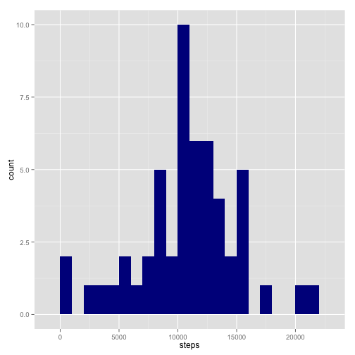
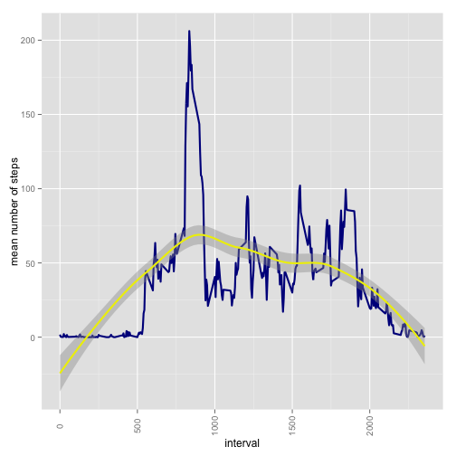
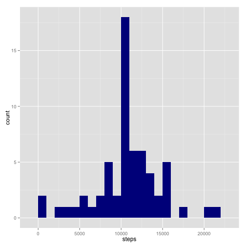
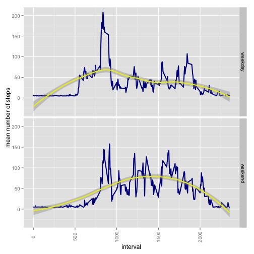

## Loading and preprocessing the data


```r
# read in data
data <- read.csv("activity.csv")

# view data
head(data)
```

```
##   steps       date interval
## 1    NA 2012-10-01        0
## 2    NA 2012-10-01        5
## 3    NA 2012-10-01       10
## 4    NA 2012-10-01       15
## 5    NA 2012-10-01       20
## 6    NA 2012-10-01       25
```

```r
# view data types
class(data$steps)
```

```
## [1] "integer"
```

```r
class(data$date)
```

```
## [1] "factor"
```

```r
class(data$interval)
```

```
## [1] "integer"
```

## What is mean total number of steps taken per day?


```r
# total number of steps per day
totalStepsPerDay <- aggregate(steps ~ date, data = data, FUN = sum)

# view data
head(totalStepsPerDay)
```

```
##         date steps
## 1 2012-10-02   126
## 2 2012-10-03 11352
## 3 2012-10-04 12116
## 4 2012-10-05 13294
## 5 2012-10-06 15420
## 6 2012-10-07 11015
```

```r
# histogram: total number of steps per day
ggplot(totalStepsPerDay, aes(x = steps)) + geom_histogram(fill = "darkblue", 
    binwidth = 1000)
```

 

```r
# histogram: total number of steps per day, other version
# ggplot(totalStepsPerDay, aes(x = totalStepsPerDay$date, y =
# totalStepsPerDay$steps)) + geom_histogram(stat = 'identity', fill =
# 'darkblue') + theme(axis.text.x = element_text(angle = 90, vjust = 0.5)) +
# stat_smooth(aes(group = 1), method = 'loess', color = 'yellow2', size = 1)
# + xlab('day') + ylab('total number of steps')
```


```r
# mean total number of steps per day
mean(totalStepsPerDay$steps)
```

```
## [1] 10766.19
```


```r
# median total number of steps per day
median(totalStepsPerDay$steps)
```

```
## [1] 10765
```

## What is the average daily activity pattern?


```r
# average number of steps per interval
averageStepsPerInterval <- aggregate(steps ~ interval, data = data, FUN = mean)

# time series: average number of steps per interval
ggplot(averageStepsPerInterval, aes(x = averageStepsPerInterval$interval, y = averageStepsPerInterval$steps)) + 
    geom_line(stat = "identity", col = "darkblue", size = 1) + theme(axis.text.x = element_text(angle = 90, 
    vjust = 0.5)) + stat_smooth(aes(group = 1), method = "loess", color = "yellow2", 
    size = 1) + xlab("interval") + ylab("mean number of steps")
```

 

```r
# interval with maximum number of steps
averageStepsPerInterval[which.max(averageStepsPerInterval$steps), ]$interval
```

```
## [1] 835
```

## Imputing missing values

Description of a strategy for imputing missing data. 


```r
# total missing values
# or: sum(is.na(data))
# or NA's in: summary(data)
sum(!complete.cases(data))
```

```
## [1] 2304
```


```r
# check data before filling missing values
summary(data)
```

```
##      steps                date          interval     
##  Min.   :  0.00   2012-10-01:  288   Min.   :   0.0  
##  1st Qu.:  0.00   2012-10-02:  288   1st Qu.: 588.8  
##  Median :  0.00   2012-10-03:  288   Median :1177.5  
##  Mean   : 37.38   2012-10-04:  288   Mean   :1177.5  
##  3rd Qu.: 12.00   2012-10-05:  288   3rd Qu.:1766.2  
##  Max.   :806.00   2012-10-06:  288   Max.   :2355.0  
##  NA's   :2304     (Other)   :15840
```

```r
# positions of NA's
naPos <- which(is.na(data$steps))

# fill missing values with NA replacements (mean of steps)
data[naPos, "steps"] <- rep(mean(data$steps, na.rm = TRUE), length(naPos))
```


```r
# check data after filling missing values
summary(data)
```

```
##      steps                date          interval     
##  Min.   :  0.00   2012-10-01:  288   Min.   :   0.0  
##  1st Qu.:  0.00   2012-10-02:  288   1st Qu.: 588.8  
##  Median :  0.00   2012-10-03:  288   Median :1177.5  
##  Mean   : 37.38   2012-10-04:  288   Mean   :1177.5  
##  3rd Qu.: 37.38   2012-10-05:  288   3rd Qu.:1766.2  
##  Max.   :806.00   2012-10-06:  288   Max.   :2355.0  
##                   (Other)   :15840
```

```r
# total number of steps per day
totalStepsPerDayFilled <- aggregate(steps ~ date, data = data, FUN = sum)

# histogram: total number of steps per day
ggplot(totalStepsPerDayFilled, aes(x = steps)) + geom_histogram(fill = "darkblue", binwidth = 1000)
```

 

```r
# mean total number of steps per day
mean(totalStepsPerDayFilled$steps)
```

```
## [1] 10766.19
```

```r
# with NA's: 10766.19
```


```r
# median total number of steps per day
median(totalStepsPerDayFilled$steps)
```

```
## [1] 10766.19
```

```r
# with NA's: 10765
```

## Are there differences in activity patterns between weekdays and weekends?


```r
# convert to date
data$date <- strptime(data$date, "%Y-%m-%d")
data$weekday <- as.factor(weekdays(data$date))

# add weekpart column
data <- data %>% mutate(weekpart = ifelse(weekday == "Saturday" | weekday == 
    "Sunday", "weekend", "weekday"))

# view data
head(data)
```

```
##     steps       date interval weekday weekpart
## 1 37.3826 2012-10-01        0  Monday  weekday
## 2 37.3826 2012-10-01        5  Monday  weekday
## 3 37.3826 2012-10-01       10  Monday  weekday
## 4 37.3826 2012-10-01       15  Monday  weekday
## 5 37.3826 2012-10-01       20  Monday  weekday
## 6 37.3826 2012-10-01       25  Monday  weekday
```

```r
# average number of steps per interval and weekpart
averageStepsPerIntervalPerWeekpart <- aggregate(steps ~ interval + weekpart, 
    data = data, mean)

# add column names
names(averageStepsPerIntervalPerWeekpart) <- c("interval", "weekpart", "steps")

# view data
head(averageStepsPerIntervalPerWeekpart)
```

```
##   interval weekpart    steps
## 1        0  weekday 7.006569
## 2        5  weekday 5.384347
## 3       10  weekday 5.139902
## 4       15  weekday 5.162124
## 5       20  weekday 5.073235
## 6       25  weekday 6.295458
```

```r
# time series: average number of steps per interval per weekpart
ggplot(averageStepsPerIntervalPerWeekpart, aes(x = averageStepsPerIntervalPerWeekpart$interval, 
    y = averageStepsPerIntervalPerWeekpart$steps)) + geom_line(stat = "identity", 
    col = "darkblue", size = 1) + facet_grid(weekpart ~ .) + theme(axis.text.x = element_text(angle = 90, 
    vjust = 0.5)) + stat_smooth(aes(group = 1), method = "loess", color = "yellow2", 
    size = 1) + xlab("interval") + ylab("mean number of steps")
```

 

